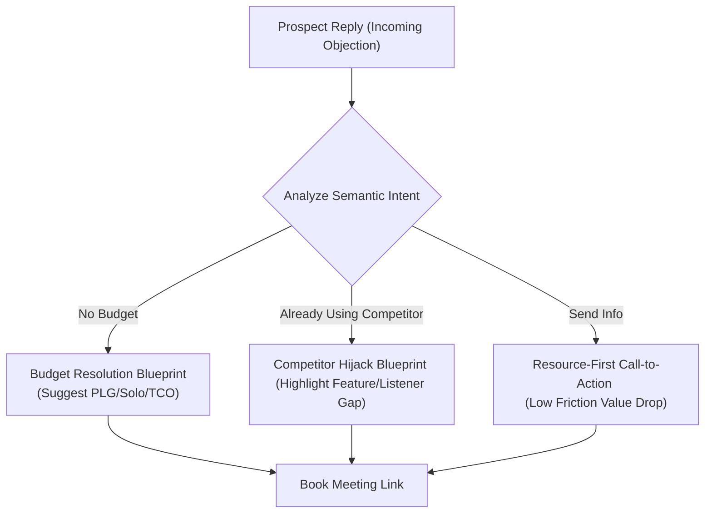

The biggest fear sales leaders have when deploying an autonomous **AI SDR** is the "wildcard reply."

They ask: *"What happens when a prospect replies with a complex, defensive sales objection? Will the AI get confused, send a robotic template, or halluncinate a false discount and embarrass our brand?"*

This is a valid concern. Standard chat bots are notoriously bad at handling B2B objections because they rely on simple keyword matching. If they see the word "budget," they automatically send the "pricing card," ignoring the actual context of the buyer's situation.

In 2026, advanced AI Reply Agents use **semantic intent mapping** and secure product knowledge bases to handle hard sales objections with the same nuance and empathy as a top-performing human rep.

Here is the exact playbook to train and configure your AI Reply Agent to resolve objections and book meetings on autopilot. For the technical foundations, see our [AI reply agents explained](/blog/ai-reply-agents-explained) guide.

---

## The 3 Hard B2B Objections and the AI Resolution Playbook

When configuring your AI SDR on a platform like [Typpout](/), you must build structured resolution pathways for the three most common B2B sales objections:

### Objection 1: "We have no budget / budget freeze"
* **The Buyer's Real Nudge**: They don't see enough immediate value to justify corporate budget reallocation.
* **The Human Approach**: Validate the economic climate, then highlight the return on investment (ROI) or offer a lower-tier entry point to prove value.
* **How to Train the AI**:
  * **Rule**: Never pitch a discount immediately. Highlight the Total Cost of Ownership (TCO) compared to legacy tools.
  * **AI Draft Response**: *"Completely understand, Sarah. Budgets are tight across the board right now. That is actually why many teams are switching to our Solo plan at $99/mo—it eliminates the expensive $10k Sales Navigator contract while delivering twice as many signal-based leads. Would you be open to a 5-minute look at how the unit economics compare?"*

### Objection 2: "We are already locked into a contract with [Competitor]"
* **The Buyer's Real Nudge**: They don't want the hassle of switching tools and transferring data.
* **The Human Approach**: Acknowledge the competitor's strengths, then point out a specific, high-value gap that the competitor cannot fill (e.g., real-time social listening).
* **How to Train the AI**:
  * **Rule**: Reference your competitor comparison cards. Highlight that your tool is designed to *supplement* their existing stack rather than completely replace it on Day 1.
  * **AI Draft Response**: *"Makes total sense, John. [Competitor] is a solid tool for database list building. The main difference is that we operate as a real-time social listener. Several clients actually run Typpout alongside [Competitor] to catch high-intent buyers on socials the millisecond they show intent. Happy to set up a quick sandbox so you can see the signal data?"*

### Objection 3: "Send me some documentation and I'll look at it"
* **The Buyer's Real Nudge**: The brush-off. They want to end the conversation without being rude.
* **The Human Approach**: Agree to send the resource, but tie it directly to a diagnostic question to keep the dialogue active.
* **How to Train the AI**:
  * **Rule**: Drop the PDF link immediately in the chat, then follow up with a highly specific, low-friction inquiry about their current GTM bottlenecks.
  * **AI Draft Response**: *"Sure thing, Mark. Here is a direct link to our 2-page GTM workflow PDF: [Link]. To ensure I send over the most relevant case studies as well: is your team currently focused on scaling up email deliverability, or is finding warm social leads the primary bottleneck?"*

---

## 3 Rules to Maintain Brand Safety

To ensure your AI Reply Agent maintains perfect professional standards, implement these structural guardrails:

* **The $0 Discount Cap**: Restrict the AI from offering custom discounts or modifying pricing structures autonomously. Price negotiations must be routed to a human sales manager.
* **The Multi-Language Switch**: Ensure your agent automatically detects the incoming language and matches the reply, allowing you to seamlessly handle European and global prospects in their native language.
* **The Human-in-the-Loop Hand-off**: If a prospect sends a highly technical question or requests a custom security questionnaire review, the AI must instantly say: *"Let me grab our lead architect to get you an exact answer on this security protocol,"* and trigger a high-priority Slack notification to your team.

For a broader framework of sales objection tactics in social contexts, read our guide on [objection handling in social selling](/blog/objection-handling-in-social-selling). By combining the speed of automation with the strategic nuance of human sales playbooks, you build a reply engine that turns cold objections into warm sales opportunities.

Want to see how Typpout's AI Reply Agent handles objections and books meetings on your calendar? [Schedule a 15-minute demo with our team](https://calendly.com/arjitsinghrajput24/15min).
