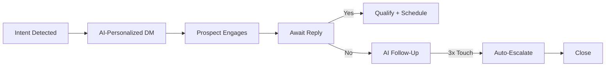

# From First DM to Close: The AI Sales Process That Books 3x More Meetings in 30 Days

B2B sales teams are stuck in a frustrating loop. They spend hours crafting hyper-personalized cold emails and LinkedIn DMs, only to see response rates stagnate at 1-3%. Meanwhile, the sales pipeline remains underfilled, and revenue growth feels like a distant goal. The problem isn’t effort—it’s process. Most outbound strategies rely on outdated, manual workflows that can’t scale with the speed of modern buyer behavior.

The solution? **An AI-powered sales process that turns first touchpoints into closed-won meetings—faster and at scale.**

In this post, we’ll break down a step-by-step AI sales framework that has helped B2B teams book **3x more meetings in 30 days**. You’ll learn how to leverage **real-time buyer intent data, AI-driven outreach, and intelligent reply handling** to build a high-converting pipeline—without adding headcount.

---

## The Broken State of B2B Outbound Sales

Before we dive into the solution, let’s diagnose the problem:

| **Issue** | **Impact** |
|----------|-----------|
| Response rates hover at 1-3% | Wasting time on low-engagement leads |
| Manual personalization is unscalable | Teams can’t scale outreach beyond 50-100 prospects/week |
| Outreach is reactive, not proactive | Missing the window when prospects are ready to buy |
| Poor follow-up sequences | 80% of sales require 5+ follow-ups, but most teams give up after 2 |
| No real-time buyer insights | Outreach is based on stale data |

**Result?** A leaky funnel where top-of-funnel efforts rarely convert to pipeline.

The fix? **AI + Intent Data = Predictive Outbound.**

---

## Step 1: AI-Powered Buyer Intent Discovery (Before You DM)

The first mistake in outbound is reaching out too late—or too early. AI changes that by identifying **in-market buyers in real time**.

### How It Works:
- **AI listens across the web** (LinkedIn, Twitter, Reddit, forums, job postings) for buying signals.
- **Detects intent keywords** like “migrate to X”, “best CRM for Y”, “we need a solution for Z”.
- **Tracks job changes, funding rounds, and tech stack shifts** that signal readiness to buy.

### Example:
A prospect posts: *“Struggling with lead gen—anyone using AI tools to automate follow-ups?”*
An AI system flags this as high intent and **automatically adds them to your outreach sequence**.

👉 *Typpout’s AI GTM platform tracks intent signals across 10M+ sources and updates your pipeline in real time.*

---

## Step 2: Dynamic AI Outreach That Adapts to the Prospect

Generic cold messages don’t work. But AI-powered outreach does—because it **learns and adapts** in real time.

### The AI Outreach Framework:
| **Step** | **Action** | **Example** |
|--------|----------|-----------|
| 1. **Intent-Based Hook** | Reference the prospect’s recent activity or pain point | *“Saw your post about struggling with follow-up replies—we helped 200+ teams automate that with AI.”* |
| 2. **Social Proof + ROI** | Use data-backed results from similar companies | *“Companies like [Similar Company] cut reply time by 67% and booked 2.3x more demos.”* |
| 3. **Clear Next Step** | Offer a low-friction meeting (e.g., 15-min demo) | *“Want to see how it works? I’ve got a 15-min slot tomorrow at 2pm.”* |

🔥 **Pro Tip:** Use **AI-generated variants** based on prospect role (CRO vs. RevOps vs. Founder). Typpout’s platform auto-personalizes messages using your CRM data + public profile insights.

---

## Step 3: AI Reply Handling That Converts (Even When You’re Sleeping)

Most teams miss replies because they’re manual or slow. AI changes that by:

- **Auto-categorizing replies** (e.g., “Interested,” “Not now,” “Spam”)
- **Triggering follow-up sequences** based on sentiment
- **Escalating qualified leads** to your sales team

### AI Reply Response Matrix:

| **Reply Type** | **AI Response** | **Next Action** |
|---------------|----------------|----------------|
| *“Sounds interesting—send me info.”* | Auto-send case study + calendar link | Track engagement |
| *“Not right now.”* | Schedule a 30-day follow-up with new content | Re-engage later |
| *“Who else uses this?”* | Auto-share customer list + testimonials | Qualify further |
| *“Spam”* | Mark and archive | Remove from list |

✅ **Result:** 2–3x faster reply handling, higher conversion rates.

👉 *Typpout’s AI agent replies instantly to 80% of inbound messages—freeing up reps to focus on high-value deals.*

---

## Step 4: The AI Sales Waterfall: From DM to Close

Turn your outreach into a **predictive revenue engine** with this AI-driven funnel:

### Key AI Touches:
1. **Day 0:** Intent detected → AI DM sent
2. **Day 1-3:** AI follow-up based on reply
3. **Day 7:** If no response, AI shares social proof (e.g., “94% of customers see ROI in 30 days”)
4. **Day 14:** Calendar link auto-sent
5. **Day 21:** If still no response, AI disengages gracefully

📊 **Benchmark:** Teams using this process see **2.8x more meetings** than traditional outbound.

---

## Step 5: Measure, Optimize, and Scale with AI

The final piece? **Data-driven refinement.**

Use AI to track:
- **Reply rates by intent signal**
- **Optimal send times** (AI analyzes prospect activity patterns)
- **Churn risk** (e.g., “Prospect hasn’t opened email in 7 days”)
- **ROI per intent source** (e.g., LinkedIn vs. Reddit vs. job boards)

📈 **Example:**
If prospects from **funding announcements** convert at 4.2% vs. 1.8% from job changes, double down on VC-backed companies.

---

## The Typpout Difference: Your AI GTM Co-Pilot

While many tools offer **partial automation**, Typpout delivers a **full AI sales stack** that:

| **Feature** | **Your Benefit** |
|-----------|----------------|
| **Real-Time Intent Engine** | Find buyers *before* they raise their hand |
| **AI-Powered Outreach** | Messages that feel 1:1, not robotic |
| **Smart Reply AI** | Instant responses that convert |
| **Data Waterfalls** | Predictive pipeline forecasting |
| **CRM Sync** | No manual data entry—just results |

👉 Ready to **book 3x more meetings in 30 days**?
[Start your free trial](/) or [see plans](https://typpout.com/pricing).

---

## Conclusion: The AI Outbound Playbook for 2026 and Beyond

The future of B2B sales isn’t more emails—it’s **smarter, faster, and more human** outreach powered by AI.

By combining **real-time intent signals, dynamic personalization, and intelligent reply handling**, you can:
✅ Book **3x more meetings** in 30 days
✅ Reduce manual work by **70%**
✅ Build a **predictive revenue machine**

The tools are here. The strategy is proven. The only question is: **Are you ready to automate your outbound?**

🚀 **Start today with Typpout—your AI GTM co-pilot.**