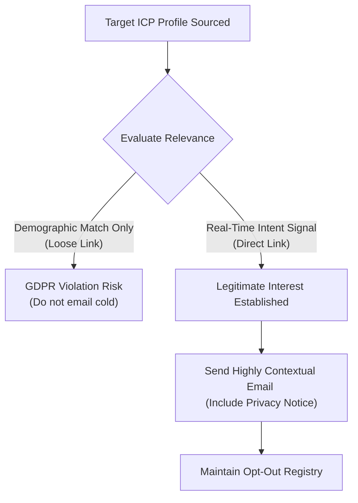

As sales organizations transition to autonomous **AI SDRs** that source leads and trigger outreach automatically, a critical operational question emerges:

*"Is this legal? How do we ensure our automated sales agents comply with complex data privacy laws like GDPR in Europe, CAN-SPAM in the United States, and LinkedIn's strict user terms of service?"*

With regulatory bodies imposing massive fines for non-compliant spam, and social platforms aggressively restricting accounts that use unapproved automation, compliance is no longer a check-box chore. It is a critical requirement to protect your brand, your domains, and your company.

Here is the ultimate guide to running **fully compliant** AI-driven outbound campaigns in 2026. For GDPR-specific compliance in the social selling context, also read our [social selling compliance and GDPR](/blog/social-selling-compliance-gdpr) guide.

---

## 1. Compliance in the US: The CAN-SPAM Act

The CAN-SPAM Act regulates commercial email in the United States. To run compliant email campaigns, your AI agent must adhere to five primary rules:

* **Rule 1: Never Use Deceptive Header Info**: Your "From," "To," and routing information must accurately identify the sender. The AI must use a real personal domain, not a spoofed alias.
* **Rule 2: Don't Use Clickbait Subject Lines**: Your subject line must clearly reflect the actual context of the email. If the subject says *"Regarding your LinkedIn post on database tools,"* the email must discuss that exact topic.
* **Rule 3: Provide a Clear Opt-Out Mechanism**: Every outbound email must include a visible, one-click unsubscribe link or clear text instructions (e.g., *"Reply 'STOP' to opt out"*).
* **Rule 4: Honor Opt-Out Requests Instantly**: If a prospect unsubscribes or replies "STOP," your GTM stack must automatically block their email across all active and future campaigns within 10 days.
* **Rule 5: Display Your Physical Address**: Your email footer must include the valid physical postal address of your business.

---

## 2. Compliance in Europe: GDPR and "Legitimate Interest"

The General Data Protection Regulation (GDPR) is significantly stricter than CAN-SPAM. It regulates how B2B companies collect, process, and contact citizens of the European Union (EU).

To run compliant B2B outbound under GDPR, you must establish **Legitimate Interest**:

* **The Sourcing Connection**: You cannot scrape millions of European citizens from database lists without prior consent. 
* **The Signal Advantage**: Sourcing leads through real-time social intent signals (such as a prospect posting: *"looking for a security tool"*) establishes clear Legitimate Interest. You have a direct, logical reason to contact them because they publicly requested assistance in your product category.
* **The Privacy Notice Requirement**: When contacting an EU citizen, your message must include a brief notice explaining how you acquired their data and how they can request deletion (e.g., *"We sourced your contact via your public LinkedIn inquiry. To request data deletion, click here"*).

---

## 3. Social Safety: Respecting Platform Guidelines

Social networks like LinkedIn and X (Twitter) have their own strict internal compliance filters to protect their users from spam.

To keep your personal profiles safe:
* **Avoid Browser Injection**: Never use extensions that inject code into your browser session—these are easily detected, resulting in immediate account restriction.
* **Respect Connection Caps**: Keep your daily LinkedIn connection requests under **20 per day**, and randomize your sending intervals to simulate natural human activity.
* **Deploy Residential Proxies**: When running headless campaigns, ensure your automation system uses dedicated residential proxies matching your exact physical location, avoiding device fingerprinting alerts.

---

## How Typpout Automates Compliance

At Typpout, we built compliance directly into our platform architecture:
* **The Global Opt-Out Registry**: When a prospect replies "STOP" or unsubscribes, Typpout blocks their profile globally across all integrations, ensuring your team never contacts them again.
* **Intent-Backed Sourcing**: We only source leads based on active, public intent signals, providing a robust legal foundation for Legitimate Interest under GDPR.
* **residential IP Protection**: Every client profile is assigned a clean, dedicated residential proxy matching their corporate geography, keeping LinkedIn interactions completely safe and organic.

For platform-specific safety tips, see our guide on [automating LinkedIn outreach safely](/blog/automating-linkedin-outreach-safely). Run a high-converting pipeline with zero legal or deliverability risks.

Ready to deploy a fully compliant AI SDR sequence for your team? [Book a 15-minute demo with Typpout today](https://calendly.com/arjitsinghrajput24/15min).
