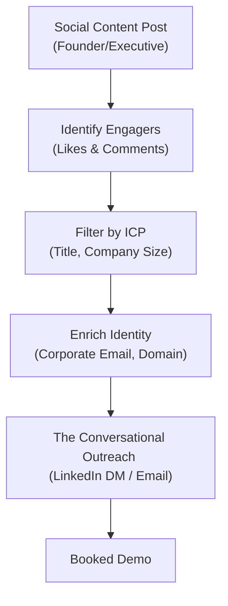

In 2026, the lines between marketing, content creation, and sales have completely dissolved. 

Startup founders, executives, and sales reps are building large personal brands on LinkedIn and X, sharing daily insights, video guides, and GTM templates. This is called **Creator-Led Growth**.

While building an audience is a massive asset, most creators struggle with a major bottleneck: **monetization**.

They generate 50,000 views, 300 likes, and dozens of comments on a post, but struggle to see how that engagement translates into booked sales demos. The connection between *social likes* and *sales revenue* remains completely broken.

To scale a creator-led business, you need an automated playbook to bridge this gap, converting superficial post engagements into direct B2B sales pipeline.

Here is the exact step-by-step strategy. For the foundations of building a high-authority personal brand, read our guide on [building a personal brand for sales](/blog/building-a-personal-brand-for-sales).

---

## The Engagement-to-Pipeline Conversion Funnel

### Step 1: The "High-Value Bait" Post
To capture high-intent leads, you must write content that attracts active buyers, not just passive scrollers. The best format is a **Template or Resource Drop**:
* *Example*: *"I spent 10 hours mapping out our 2026 email deliverability checklist. Comment 'DNS' below and I'll send you the Notion template for free!"*
* **Why it works**: Anyone who comments is self-identifying as having an active challenge in that category, creating an instant lead list.

---

### Step 2: ICP Sifting & Enrichment
Not everyone who likes or comments on your post matches your Ideal Customer Profile. You must filter out low-value leads:
* **The Manual Grind**: Reps click on every single profile, check their job title and company size, and look up their email in a database.
* **The Automated Route**: Use [Typpout](/) to scan your post engagements automatically. Our platform instantly sifts out students and consultants, and retains only VP and Director-level roles matching your exact demographic criteria.

---

### Step 3: The Conversational Inbox Bridge
Reach out to the qualified engagers within **2 hours** of their comment. Because they engaged with your post, your message is highly expected and welcome.

* **For Commenters (The Direct Hand-off)**:
  > *"Hey [Name], thanks for the comment on my deliverability post! Here is the direct link to the Notion template: [Link].*
  > 
  > *Curious: is your team currently focused on improving your cold email deliverability, or are you just looking at stack setup for next quarter?"*

* **For Likers (The Social Footprint Hook)**:
  > *"Hi [Name], saw you liked my post on signal-based outbound today. Genuinely appreciate the support!*
  > 
  > *We've been seeing a massive shift from traditional databases to real-time intent cues. How is your team currently sourcing leads for your outbound sequences?"*

---

## Why Creator-Led Outbound Converts Better

Outreach to social engagers yields conversion rates that are **10 to 15 times higher** than traditional cold outreach for three primary reasons:

1. **Prior Brand Equity**: The prospect has already consumed your content. They trust your expertise and recognize your name.
2. **Instant Context**: You don't have to struggle to find a hook; the post they engaged with provides immediate, relevant context.
3. **Conversational Ease**: The interaction begins on a social network as a peer-to-peer discussion, bypassing corporate email defense mechanisms.

For more on what types of content actually generate pipeline, see our guide on [LinkedIn content that generates leads](/blog/linkedin-content-that-generates-leads). Stop letting your social views go to waste. Turn your audience into a predictable, automated pipeline of qualified business.

Ready to turn your social content views into paying customer demos? [Schedule a 15-minute demo with Typpout today](https://calendly.com/arjitsinghrajput24/15min).
