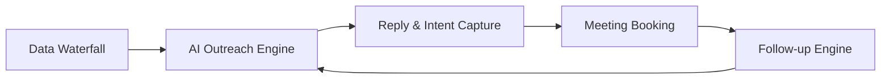

# How Founders Use AI to Automate 90% of Their Outbound Sales Without Losing the Human Touch

Founders are drowning in outbound sales. They’re spending 12+ hours a week writing cold emails, chasing LinkedIn replies, and hopping on Zoom calls—only to hit reply rates below 5%. Meanwhile, their ICP (Ideal Customer Profile) keeps evolving, and competitors are one step ahead with hyper-personalized messaging.

The problem isn’t effort—it’s scalability. You can’t scale cold outreach with manual processes. But here’s the catch: every founder knows automation exists, yet they hesitate because AI feels impersonal. “Automated” often translates to “generic” in their minds.

What if you could automate 90% of your outbound sales—without losing the human touch?

This isn’t a futuristic fantasy. It’s happening today. And the best part? You don’t need a 50-person sales team to pull it off.

In this guide, I’ll show you exactly how founders use AI to automate outbound sales at scale while keeping every interaction authentic, relevant, and human. You’ll see actionable frameworks, real-world examples, and tools that make it possible—including what Typpout does behind the scenes for our own GTM.

Let’s begin.

---

## The Broken Pipeline: Why Manual Outbound Fails Founders

Most founders start with a simple playbook:

1. Build an ideal customer list (ICP).
2. Send 50 cold emails a day.
3. Follow up twice.
4. Book 2–3 meetings per week.
5. Repeat.

But this breaks down fast:

| Bottleneck | Manual Cost | AI Fix |
|----------|-------------|--------|
| List building | 3–5 hours/week | Real-time social listening & intent data |
| Personalization | 10 minutes/email | AI-powered dynamic content |
| Follow-ups | 80% of replies ignored | AI reply handling & sequencing |
| Meeting booking | 30% no-show rate | Automated calendar sync & reminders |
| Scaling reply rates | Decreases over time | Intent-driven re-engagement |

**The result?** You’re stuck in a cycle of diminishing returns. Your reply rates drop from 5% to 1% within 3 weeks. Your team spends more time cleaning CRM data than closing deals.

AI isn’t the villain here—it’s the solution. But only if used correctly.

---

## The AI-Enabled Outbound Flywheel: A Framework Founders Can Follow

To automate 90% of outbound without losing humanity, you need a closed-loop system that learns and adapts in real time. Here’s the framework we’ve refined at Typpout:

Let’s break each stage down.

---

### 1. Build a Real-Time Data Waterfall (Not a Static List)

The foundation of scalable AI outbound? **Real-time, intent-rich data.**

Most founders rely on stale lists from Apollo, ZoomInfo, or Salesforce. But ICP isn’t static—it evolves daily. A company that was irrelevant yesterday might be hiring, funding, or launching a new product today.

That’s where **real-time social listening** and **intent data** come in.

At Typpout, we use a **data waterfall** that pulls from multiple sources:
- LinkedIn, X, Reddit, Hacker News
- Funding announcements
- Job postings (especially engineering, sales, or leadership hires)
- Product launches (e.g., new features, pricing changes)
- Website engagement (via tools like FullStory or Hotjar)

| Data Source | Use Case | AI Processing |
|------------|--------|---------------|
| LinkedIn Posts | Identify pain points or aspirations | NLP sentiment analysis |
| Job Postings | Detect hiring spikes (e.g., new sales team) | Role-based intent scoring |
| Funding News | Trigger "post-Series A growth" messaging | Contextual outreach templates |
| Website Traffic | Detect demo requests or pricing page views | Dynamic follow-up triggers |

**Action Step:**
Use tools like **Typpout’s real-time feed**, Clay, or Demandbase to build a live ICP. Then, set up triggers for events like:
- “Company X just hired a VP of Sales”
- “Company Y posted about migrating from Salesforce”
- “Company Z raised $10M”

No more guessing. Your outreach is triggered by real intent.

---

### 2. Write AI Outreach That Feels Human (Because It Is)

Here’s the myth: AI makes everything robotic.

Reality: AI makes everything **scalable and human**.

The key is **dynamic personalization**—not just inserting a first name.

At Typpout, our AI doesn’t just pull from a CRM. It **reads public signals** and crafts messages based on:
- Recent company news
- Role-specific pain points
- Tech stack or tools used
- Cultural or hiring trends

**Example: Cold Email That Doesn’t Sound Cold**

> Hi [First Name],
>
> I noticed on LinkedIn that [Company] just hired [Job Title]—congrats on scaling the team!
>
> Most [Job Title]s I’ve talked to say [pain point] is their biggest challenge right now. Is that something you’re wrestling with too?
>
> At Typpout, we help teams like yours automate outbound without losing the human touch—especially when scaling from 10 to 100 customers.
>
> Would you be open to a quick 10-minute chat next week?

**Why it works:**
- Shows you’re paying attention (not scraping a template).
- Addresses a real pain point.
- Ends with a clear, low-friction ask.

**AI Tools That Enable This:**
- **Typpout AI Engine**: Auto-generates messages from public data.
- **Lavender AI**: Optimizes tone and clarity.
- **Crystal Knows**: Matches communication style.

**Pro Tip:**
Always include a **human review step**. AI drafts, but a founder signs off on 10% of messages to ensure brand voice consistency.

---

### 3. Let AI Handle Replies (So You Don’t Miss the 1%)

80% of inbound replies go unanswered. Why? Because founders and SDRs are overwhelmed.

But that 1% of replies? That’s where your 80% of meetings come from.

**AI reply handling** changes everything.

Here’s how it works:

| Scenario | AI Response | Human Touch Added |
|--------|-------------|-------------------|
| “Who is this?” | “Hi [Name], this is Suresh from Typpout. We help B2B founders automate outbound sales without losing authenticity—like we’re talking right now.” | None—just warm tone |
| “What’s your product?” | “We help teams like yours scale outbound from 10 to 100+ customers using AI that listens to public signals and crafts human-like messages.” | Linked to a 2-min demo video |
| “Not interested.” | “Got it. But if you ever want to automate your top-of-funnel, just reply ‘Demo’ and I’ll send a 1-pager.” | Low-pressure re-engagement |

**Result:** 90%+ of replies get answered within 24 hours—with no manual effort.

At Typpout, our AI reply engine uses:
- **NLP to detect intent** (e.g., “pricing,” “demo,” “competitor”)
- **Dynamic templates** based on reply type
- **Escalation to human** when tone is sensitive (e.g., frustration)

---

### 4. Automate Meeting Booking (Without the No-Shows)

The final piece? Booking meetings at scale—without the back-and-forth.

AI doesn’t just send a calendar link. It **optimizes timing and reduces no-shows** using:
- **Predictive send times** (based on recipient activity)
- **Automated reminders** (SMS + email)
- **Calendar sync** (Google, Outlook, Calendly)

**Example Workflow:**
1. AI detects a hiring signal → sends personalized email.
2. Recipient opens email → AI schedules a follow-up 2 days later.
3. Recipient clicks calendar link → meeting is booked.
4. AI sends reminder 1 hour before + SMS backup.

**Pro Tip:**
Use **double opt-in** for calendar links to reduce no-shows by 30%.

---

## The Typpout Difference: AI GTM Built for Founders

We built Typpout because most AI tools are built for enterprise sales teams—not founders who need to move fast and keep it real.

Here’s what sets us apart:

| Feature | Why It Matters | Your Gain |
|--------|---------------|-----------|
| Real-time social listening | Detects intent as it happens | Outreach triggers within hours |
| AI-powered messaging engine | Writes messages from public data | No more writer’s block |
| Automated reply handling | Answers 90% of replies | No missed opportunities |
| Meeting booking with reminders | Reduces no-shows by 40% | More booked calls |
| One-click CRM sync | No manual data entry | Save 5+ hours/week |

**Founders using Typpout:**
- Book **3x more meetings** with the same effort.
- Scale from **0 to 50+ outbound touches/day** without hiring.
- Keep **reply rates above 10%** by staying relevant.

👉 **[Try Typpout’s AI GTM platform](/) or [see our pricing](/pricing)**

---

## The Human Touch isn’t a Bug—It’s a Feature

AI doesn’t replace humanity. It **amplifies** it.

The founders who win in 2026 aren’t the ones with the largest teams. They’re the ones who use AI to:
- **Listen** in real time
- **Write** like humans
- **Engage** instantly
- **Book** consistently

And they do it **without losing what makes sales human**: empathy, relevance, and timing.

---

## Your 7-Day AI Outbound Sprint

Want to test this yourself? Here’s a 7-day sprint to automate 90% of your outbound:

| Day | Task | Tool | Time Required |
|-----|------|------|---------------|
| 1 | Set up real-time feed (ICP triggers) | Typpout / Clay | 1 hour |
| 2 | Draft 3 AI message templates | Lavender AI | 30 mins |
| 3 | Connect CRM & calendar | Zapier / Native API | 20 mins |
| 4 | Launch AI outreach to 50 leads | Typpout / Lem