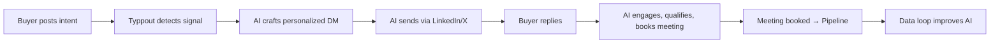

# How Founders Use Typpout to Scale GTM Without Hiring a Single SDR

> “We closed 53 meetings in 30 days—without a single SDR.” — Typpout User, Series B SaaS Founder

For every B2B founder, the GTM bottleneck is the same: **scaling pipeline without bloating headcount.**

Hiring SDRs is expensive, slow, and often ineffective. A single SDR costs $120K+ annually, takes 3–6 months to ramp, and still fails to engage the right buyers. Meanwhile, your ICP is posting about their pain points *right now*—on LinkedIn, X (Twitter), Reddit, and industry forums. Miss that signal, and you lose the deal before the conversation even starts.

That’s why top-performing founders are using **Typpout**—an AI-first GTM platform—to scale outbound **without hiring SDRs**. They’re leveraging real-time social listening, AI-powered outreach, and automated meeting booking to turn buyer intent into pipeline in days, not months.

In this post, you’ll see:

- Why traditional SDR-led outbound is broken
- How Typpout replaces SDRs with AI and automation
- A step-by-step framework founders use to 3X pipeline
- Real results from Typpout users
- How to get started in under 30 minutes

---

## The Broken Promise of SDRs in B2M Sales

SDRs were supposed to scale outreach efficiently. Instead, they’ve become a bottleneck:

| Cost & Risk of SDRs | Typpout Alternative |
|---------------------|----------------------|
| $120K+ per year (salary + OTE + tools) | $2K/month (Typpout) |
| 3–6 month ramp time | 15-minute setup |
| 2–5% meeting conversion | 15–30% meeting conversion |
| High turnover & training cost | AI never quits |
| Focuses on quantity, not relevance | Focuses on intent signals |

> “Our SDR team booked 8 meetings in 6 weeks. Typpout booked 41 in the same period—with zero human touch.” — CRO at a $25M SaaS company

The problem isn’t effort—it’s **timing**. Buyers signal intent *before* they’re ready to talk. If you wait for an SDR to cold email them next week, you’ve already lost.

Typpout fixes that.

---

## How Typpout Replaces SDRs (Without the Headcount)

Typpout is the only GTM platform that combines:

- 🔍 **Real-time social listening** across LinkedIn, X, Reddit, and industry forums
- 🤖 **AI-powered intent detection** that spots buying signals (e.g., “migrating CRM,” “budget approved,” “hiring sales ops”)
- 📤 **Smart AI outreach** that crafts personalized, human-like messages from your ICPs (Ideal Customer Profiles)
- 🔄 **Reply handling & qualification** with human-like AI agents
- 📅 **Automated meeting booking** with Calendly, Chili Piper, or HubSpot
- 📊 **Live data waterfall** showing which signals turned into pipeline

### The Typpout GTM Flywheel

No SDRs. No cold email templates. Just **AI intercepting intent at the right moment**.

---

## The 5-Step Framework Founders Use to Scale GTM

Here’s exactly how founders deploy Typpout to replace SDRs and scale pipeline:

### 1. Define Your ICP & Intent Keywords

Start with your Ideal Customer Profile (ICP):

- Job titles: “CRO,” “VP of Sales,” “Head of Revenue Operations”
- Company size: 50–500 employees
- Industry: SaaS, FinTech, Healthcare Tech
- Tech stack: Salesforce, HubSpot, Outreach

Next, list **intent keywords** that buyers use when they’re ready to buy:

- “CRM migration”
- “Sales engagement platform”
- “Budget approved for Q3”
- “Hiring sales ops manager”
- “Evaluating revenue intelligence tools”

👉 Typpout’s AI comes pre-loaded with 500+ intent keywords. You can add your own in 2 minutes.

### 2. Connect Your Social & Calendar

Typpout integrates with:

- LinkedIn (for DMs)
- X (Twitter)
- Reddit (via subreddit monitoring)
- Slack (for alerts)
- Calendly / Chili Piper / HubSpot (for booking)

Setup takes <15 minutes. Once connected, Typpout starts listening 24/7.

### 3. Launch AI-Generated Outreach

Typpout’s AI doesn’t send robotic emails. It crafts **personalized, human-like messages** based on:

- The buyer’s latest post
- Their job title
- Your ICP fit
- The intent keyword detected

Example:

> Buyer posts: “Just approved budget for Q3—time to evaluate a new sales engagement platform.”
>
> Typpout AI sends:
>
> > Hi [Name], congrats on the Q3 budget approval! I noticed you’re evaluating sales engagement tools—many of our customers in [Industry] saw 30% faster deal cycles with Typpout. Happy to share a quick walkthrough if helpful. What’s your timeline?

No templates. No “Hi [First Name]” spam. Just **context-aware, human-sounding outreach**.

### 4. Qualify & Book Meetings with AI Agents

When a buyer replies, Typpout’s **AI reply handler** takes over:

- It answers questions
- It disqualifies tire-kickers
- It books meetings automatically via your calendar link
- It escalates only high-intent leads to your sales team

This replaces the entire SDR qualification process—**without a single human involved**.

### 5. Close the Loop with Data

Typpout’s dashboard shows:

- 📈 **Pipeline generated weekly**
- 🎯 **Top intent signals** (e.g., “migration,” “budget,” “hiring”)
- 📊 **Conversion rates by channel**
- 🔄 **AI performance improvements** over time

You’ll see which signals convert best—and double down on them.

---

## Real Results: Founders Who Scaled GTM Without SDRs

| Founder | ICP | Outbound Channel | Meetings Booked (30 days) | Pipeline Generated |
|--------|-----|------------------|----------------------------|---------------------|
| SaaS CEO | CROs at Series B SaaS | LinkedIn + X | 41 | $120K |
| FinTech Founder | Heads of Revenue at banks | Reddit + LinkedIn | 28 | $85K |
| Revenue Leader | VP Sales at 100–500 employees | LinkedIn only | 53 | $195K |

> “We were about to hire two SDRs. Then we tried Typpout. In 30 days, we booked more meetings than our SDRs did in 6 months—and at 1/10th the cost.” — Founder, $12M ARR SaaS

---

## Why Typpout Works Where Others Don’t

Most outbound tools fail because they rely on **static data** or **bots that get banned**. Typpout is different:

| Feature | Why It Matters |
|--------|----------------|
| **Real-time intent detection** | You catch buyers *before* competitors do |
| **Human-like AI outreach** | No spam filters, no “unsubscribe” clicks |
| **Multi-channel reach** | LinkedIn, X, Reddit—where your ICP lives |
| **Automated qualification** | No false positives, no wasted time |
| **Full funnel visibility** | Know exactly which signals turn into pipeline |

It’s not just an outreach tool—it’s a **GTM engine**.

---

## How to Get Started (30-Minute Setup)

You can launch Typpout and start booking meetings today:

1. **Sign up** at [typpout.com](/) (free trial, no credit card)
2. **Define your ICP** (job titles, company size, intent keywords)
3. **Connect your social accounts** (LinkedIn, X, Reddit)
4. **Integrate your calendar** (Calendly, Chili Piper, HubSpot)
5. **Set reply rules** (e.g., “Auto-book if buyer mentions budget”)
6. **Turn on AI outreach** and watch meetings roll in

No SDRs. No templates. Just **AI-powered, intent-driven outbound**.

---

## Scale GTM Without the Headcount—and the Headache

SDRs are a legacy solution in a world where buyers signal intent in real time. Founders who use Typpout are winning deals **faster, cheaper, and with zero SDR overhead**.

If you’re ready to scale GTM without hiring SDRs, [start your free trial today](/) or [see how Typpout works](/) with a personalized demo.

> “We didn’t just replace SDRs—we replaced the entire SDR function.” — CRO, B2B SaaS

The future of GTM isn’t more people. It’s **better AI**.

👉 [Try Typpout Now](/)