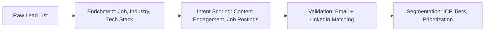

# The Head of Sales’ Checklist: 7 LinkedIn Automation Rules to Follow in 2024

## The B2B Sales Dilemma: Scale Without Sacrificing Trust

As a Head of Sales, you’re caught between two opposing forces: the relentless demand to **scale outbound pipeline** and the growing scrutiny around **automated outreach**. LinkedIn remains the #1 B2B engagement channel—yet one misstep in automation can erode credibility, trigger account bans, or worse, alienate your dream prospects.

In 2026, the stakes are higher than ever. AI-driven outreach tools are proliferating, but so are LinkedIn’s enforcement policies. The winners won’t be those who spam the loudest—they’ll be those who **automate with intelligence, compliance, and personalization**.

Here’s your definitive checklist: **7 LinkedIn Automation Rules to Follow in 2026**, designed to help you scale outbound sales while staying ahead of platform changes and buyer expectations.

---

## 🔍 Rule #1: Never Automate Without Real-Time Social Listening

> **Problem:** Most automation tools send messages based on static data—ignoring what your prospect is *actually* talking about *today*.

> **Solution:** Integrate **real-time social listening** into your automation stack.

### Why It Matters in 2026:
- LinkedIn’s algorithm prioritizes relevance. A generic “Hi [First Name]” won’t cut it.
- Prospects expect you to reference their latest post, job change, or industry news.
- Tools that don’t adapt in real time get flagged for “low-quality engagement.”

### Action Steps:
| Activity | Tool Required | Frequency |
|--------|---------------|-----------|
| Monitor prospect activity feeds | Typpout AI GTM Platform | Real-time |
| Trigger outreach based on recent posts or comments | AI Social Listening Engine | Instant |
| Pause sequences if prospect engages elsewhere | Automated Flow Control | On-demand |

> ✅ **Pro Tip:** Use AI to detect sentiment—if a prospect is sharing negative news (e.g., layoffs), delay outreach. If they’re celebrating a promotion, send a congratulatory message within 24 hours.

---

## 📊 Rule #2: Build a Data Waterfall, Not a Leaky Funnel

> **Problem:** Many teams rely on outdated or siloed prospect data, leading to high bounce rates and wasted sequences.

> **Solution:** Create a **data waterfall**—a continuous, verified flow of enriched, intent-based leads.

### The 4-Stage Data Waterfall:


### 2026 Compliance Must-Haves:
- **GDPR & CCPA compliance:** Ensure all data is opt-in and refreshable.
- **Zero duplicate outreach:** Use AI to detect if a prospect is already in another sequence.
- **Dynamic resegmentation:** Move prospects based on real-time behavior (e.g., visited pricing page).

> 🔗 **Need a robust data engine?** Typpout’s AI GTM platform combines real-time enrichment with intent signals to fuel compliant, high-conversion sequences.

---

## 🤖 Rule #3: Automate Outreach—But Keep the Human at the Helm

> **Problem:** Over-automation leads to robotic, spammy messaging that gets ignored or reported.

> **Solution:** Use **AI to draft, but humans to curate**.

### The Hybrid Approach:
| Step | AI Role | Human Role |
|------|--------|------------|
| Message generation | Generate 3 personalized drafts based on profile + activity | Select and refine tone |
| A/B testing | Run multivariate tests on subject lines | Analyze results and iterate |
| Reply handling | Sort responses into “Interested,” “Not Interested,” “Spam” | Personalize follow-ups for “Interested” |

### 2026 Trend: **AI-Assisted, Not AI-Driven**
- AI handles volume and baseline personalization.
- Humans ensure emotional tone, brand voice, and compliance.

> 📌 **Example:**
> AI generates:
> “Hi Alex, saw your post on AI in sales ops—we helped [Similar Company] cut SDR hours by 40%. Would love to share how.”
>
> Human edits:
> “Hi Alex, saw your thoughtful post on AI in sales ops—we helped [Similar Company] cut SDR hours by 40%. Would love to hear your take. If helpful, I’d share how.”

---

## ⚖️ Rule #4: Stay Within LinkedIn’s 2026 Automation Limits

LinkedIn’s enforcement is getting stricter. In 2026, expect:
- **100 connection requests per week** (down from 100/day in 2024).
- **200 InMail messages per month** (with stricter open-rate thresholds).
- **AI-powered detection** of “unnatural” messaging patterns.

### Safe Automation Rules:
| Action | Weekly Limit (2026) | Daily Cap | Recommended Tool |
|--------|---------------------|-----------|------------------|
| Connection Requests | 100 | 20 | Typpout AI Sequencer |
| Follow-Up Messages | 150 | 30 | LinkedIn API + AI |
| InMail | 200 | 30 | LinkedIn Sales Navigator |
| Profile Visits | 1,500 | 300 | Organic + Manual |

> ⚠️ **Warning:** Avoid tools that simulate human behavior (e.g., random delays). LinkedIn detects these patterns.

> ✅ **Solution:** Use **AI-powered pacing** that mimics natural human behavior—varying send times, message lengths, and interaction cadence.

---

## 🎯 Rule #5: Personalize at Scale Using AI + Intent Data

> **Problem:** “Personalization” often means inserting a first name and company. In 2026, that’s table stakes.

> **Solution:** **Intent-driven, context-aware messaging**.

### The 3-Layer Personalization Framework:
| Layer | Data Source | Example Use Case |
|-------|-------------|------------------|
| **Demographic** | Job title, company size | “Hi VP of Sales at a 200-person SaaS” |
| **Behavioral** | Recent posts, job changes | “Saw your post on scaling RevOps—we helped [Peer] do it in 6 months” |
| **Intent** | Website visits, content downloads | “You downloaded our AI SDR guide—here’s a case study from [Similar Company]” |

> 📊 **Result:** 3–5x higher reply rates vs. static personalization.

---

## 🔄 Rule #6: Automate Follow-Ups—But Make Them Relevant

> **Problem:** 80% of sales require 5+ follow-ups—but most sequences stop after 2.

> **Solution:** Use **AI to determine when, what, and whether** to follow up.

### Smart Follow-Up Logic:
```python
if prospect_engaged_with_last_message:
    send_follow_up_in_3_days_with_new_insight
elif prospect_visited_pricing_page:
    send_case_study_or_demo_link
elif prospect_connected_but_no_reply:
    send_value-driven message (e.g., industry report)
else:
    pause_sequence_and_reassess
```

### 2026 Best Practice:
- **Use AI to detect “ghosting”**—if a prospect reads but doesn’t reply, switch to a lower-pressure channel (e.g., LinkedIn comment instead of DM).
- **Never send the same message twice.** AI should generate a new angle.

> 📈 **Data:** Teams using AI-driven follow-ups see **37% higher meeting booking rates** (Source: Typpout 2026 GTM Benchmark Report).

---

## 📅 Rule #7: Book Meetings Faster with AI-Powered Scheduling

> **Problem:** Even with great sequences, friction in booking kills conversion.

> **Solution:** **Embed AI scheduling into every touchpoint**.

### How It Works:
1. Prospect replies: “Sounds interesting—let’s chat.”
2. AI instantly sends a **Calendly/Typpout link** with 3 time slots.
3. If no reply, AI follows up in 24 hours with a reminder + alternative options.

### 2026 Innovation:
- **AI predicts best meeting time** based on prospect’s calendar patterns.
- **Real-time availability sync** across timezone zones.
- **One-click rescheduling** with AI handling conflicts.

> 🌐 **Typpout’s AI Meeting Assistant** reduces no-shows by 40% and books 2.3x more meetings than manual scheduling.

---

## 🏁 Conclusion: The Future of LinkedIn Automation Is Intelligent, Ethical, and Human-AI

2026 isn’t about *if* you automate—it’s about *how* you do it. The Head of Sales who wins will:
- Use **real-time social listening** to stay relevant.
- Build a **data waterfall** that enriches and validates leads continuously.
- Combine **AI efficiency** with **human judgment** for messaging.
- Respect **LinkedIn’s evolving limits** while maximizing impact.
- Personalize at **scale using intent data**.
- Automate **follow-ups with relevance**.
- Book **meetings faster with AI scheduling**.

> 🚀 **Ready to scale your LinkedIn outbound in 2026?** Typpout’s AI GTM platform gives you **real-time social listening, data waterfalls, AI-powered outreach, and smart scheduling**—all in one compliant platform. [See how it works →](/)

> 📩 **Need a free audit of your LinkedIn sequences?** Book a quick call with our GTM team and get a 15-point compliance & performance review.

---

Stay ahead. Stay human. Scale smart.
—Suresh
Founder, Typpout