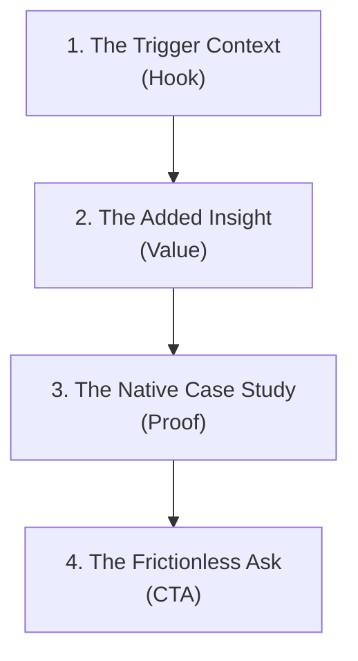

The most common mistake sales reps make when transitiong to signal-based outbound is **lazy personalization**.

They set up a social listener, catch a prospect posting about a challenge, and send a message like this:
> *"Hi John, I saw your post about sales tracking tools. We are an AI sales tracking platform..."*

This is what we call "personalization theater." You are simply reflecting their own data back at them, then jumping straight into a generic product pitch. It feels transactional, robotic, and fails to build trust.

To convert a warm social signal into a booked demo, you must use the **Social Context Copywriting Formula**. Your message should bridge the gap between *what the prospect said* and *the exact value you deliver*, proving that you understand their situation deeply.

Here is the step-by-step blueprint to write highly custom sales pitches using social listening context. For the foundational principles of context-driven messaging, read our guide on [AI personalization at scale](/blog/ai-personalization-at-scale).

---

## The 4-Step Social Copywriting Formula

When writing a signal-based message, structure your copy using this four-step sequence:

### 1. The Trigger Context (The Hook)
State clearly where and why you are reaching out, referencing their specific post or comment without being creepy.
* *Example*: *"Saw your comment on LinkedIn about the difficulty of maintaining email deliverability when scaling sequences."*

### 2. The Added Insight (The Value)
Don't pitch your tool yet. Provide a quick, actionable insight or a helpful observation related to their problem. This establishes you as an expert, not a solicitor.
* *Example*: *"Usually, when deliverability drops at that stage, it's due to domain fingerprinting or sending in structured 30-second blocks, which spam filters easily flag."*

### 3. The Native Case Study (The Proof)
Connect their problem directly to a result you achieved for a similar company, using concise, metric-driven language.
* *Example*: *"We recently helped a GTM team randomize their sending patterns using social intent cues, which boosted their inbox placement from 75% to 98%."*

### 4. The Frictionless Ask (The CTA)
Offer a low-commitment, value-first call to action. Do not ask for a 30-minute sales meeting. Offer to share a resource, a tip, or a custom audit.
* *Example*: *"I wrote a brief 2-page checklist on how to configure your DNS records to bypass the new 2026 filters. Happy to send it over if you'd like?"*

---

## Putting It Together: Before and After

Let's look at how this formula transforms a standard pitch into an irresistible, high-conversion message:

### Scenario:
A prospect posts: *"Our SDRs are spending half their day manually scrubbing Apollo lists. Need to automate lead finding."*

### The "Before" Pitch (Lazy Personalization)
> *"Hi Mark, saw your post about manual lead scrubbing. We are Typpout, an AI sales agent that automates top-of-funnel work and imports contacts. We'd love to jump on a demo to show you how our tool works. Let me know what time works this week?"*
* **Why it fails**: It's all about "us." It asks for a meeting immediately without proving value, and treats their post as a simple excuse to pitch.

### The "After" Pitch (Social Context Formula)
> *"Hi Mark, saw you're looking to cut down on the manual list scrubbing for your SDRs. Genuinely exhausting work for reps.*
> 
> *Most teams find that instead of building lists from static databases, listening to real-time intent cues on socials reduces research time by 90% because you only target people who are actively in-market.*
> 
> *We actually built an autonomous listener that pipes warm leads straight into HubSpot when they post a trigger. I'd love to share the exact trigger list we used to help a similar seed startup book 15 meetings last month.*
> 
> *Open to a quick look at the trigger list?"*
* **Why it succeeds**: It validates their frustration, explains a new strategic approach (moving from databases to intent), provides social proof, and offers a low-friction resource drop as the call-to-action.

---

## How to Scale Social Personalization

Writing these custom pitches manually for 50 leads a day is time-consuming. You can automate this execution by integrating a conversational platform like [Typpout](/). 

Our AI outreach engine automatically reads the context of the social post, applies the Social Context Formula, references your product knowledge base, and drafts a hyper-personalized response for you to review and approve with a single click.

For more copywriting templates, check our guide on [how to write cold DMs that convert](/blog/how-to-write-cold-dms-that-convert). Stop pitch-slapping your prospects. Start engaging with context.

Want to see how Typpout writes custom, high-conversion pitches in seconds? [Book a 15-minute demo with our team today](https://calendly.com/arjitsinghrajput24/15min).
