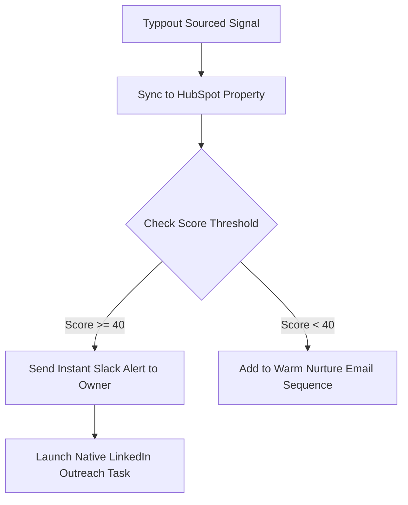

Most B2B marketing and sales teams operate their CRM (HubSpot, Salesforce, or Pipedrive) like a static address book. They collect contact details from forms, store them in fields, and set up basic scoring models based on demographic data:
* +10 points if the job title contains "VP" or "Director."
* +5 points if the company size is over 100 employees.
* +15 points if they visit the pricing page.

This is a decent baseline, but it has a major blind spot: it ignores the **entire social web**.

If a target executive at a key account posts on LinkedIn that they are actively looking to replace their current sales stack, your CRM remains completely blind to that event. The lead score doesn't change, and your sales rep has no idea a massive buying window has opened.

In 2026, high-performing sales ops teams are solving this by piping — as we explain in our [CRM integration for social selling](/blog/crm-integration-social-selling) guide — **real-time social intent signals** directly into their CRM to create dynamic lead scoring models.

---

## The Social Intent Lead Scoring Matrix

To build an effective social scoring model, you must categorize social signals by their depth of intent and assign appropriate scores.

Here is a recommended scoring framework to implement in your CRM:

| Social Trigger Event | Intent Level | HubSpot / Salesforce Score | Recommended Action |
|---|---|---|---|
| Posts a recommendation request matching your category | **Critical** | +50 points | Instant Slack alert; manual custom outreach within 5 mins |
| Mentions your competitor's name in a negative thread | **High** | +40 points | Route to SDR for competitor switch outreach |
| Likes or comments on a competitor’s product announcement | **Medium** | +20 points | Add to warm competitor-comparison sequence |
| Connects with your founder or GTM leader on LinkedIn | **Low** | +10 points | Automatic warm welcome message |
| Follows your company page on LinkedIn or X | **Low** | +5 points | Add to remarketing audience list |

---

## 3 Steps to Integrate Social Signals Into HubSpot

Integrating real-time social listening triggers into your HubSpot workflow is straightforward when using a native connector like [Typpout](/).

### Step 1: Create Custom CRM Properties
First, set up custom contact and company properties in HubSpot to hold your social signal data. We recommend creating:
* **Last Social Intent Trigger** (Text Field): Stores the exact text of the social post that matched your signal library.
* **Social Intent Score** (Number Field): A rolling tally of their social interactions.
* **Social Profile URL** (Link): Direct link to their LinkedIn, X, or Instagram profile.

### Step 2: Configure the Sync Workflow
Configure Typpout to listen for intent triggers across social channels. When a trigger is detected, Typpout automatically:
1. Performs a database search to see if the contact already exists in your HubSpot CRM.
2. If they exist, it updates their **Last Social Intent Trigger** and increments their score.
3. If they do not exist, it creates a new contact record, enriches it with corporate email and company data, and tags it as a *Social Intent Lead*.

### Step 3: Trigger the Sales Playbook
Build an automated workflow in HubSpot triggered by the update to the *Last Social Intent Trigger* field:

---

## The Benefits of CRM-Integrated Listening

Piping social signals directly into your central CRM delivers three massive benefits for your sales ops team:

* **No More Missed Windows**: Your reps get alerted to intent opportunities where they already work, eliminating the need to monitor multiple standalone tools.
* **Flawless Context for Calls**: When an SDR calls a prospect, they can view the exact LinkedIn post the prospect wrote directly on their CRM activity timeline, making the call feel incredibly warm.
* **Accurate ROI Attribution**: You can track exactly which deals were sourced by social signals, allowing you to measure the exact ROI of your social listening program against cold list purchases.

For a full breakdown of the different types of intent signals you can score, see our [intent data types comparison](/blog/intent-data-types-comparison). Stop letting warm sales conversations happen in silos. Pipe your social intent straight into your CRM.

Want to see how Typpout syncs real-time LinkedIn and X intent leads directly into HubSpot or Salesforce? [Book a 15-minute demo with our team](https://calendly.com/arjitsinghrajput24/15min).
