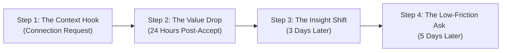

Most LinkedIn outreach campaigns fail because they treat the inbox as a cold email channel. 

They send a connection request, wait for the prospect to accept, and immediately trigger a four-paragraph message explaining their company history, product features, and asking for a 30-minute calendar call.

On social networks, this behavior is a conversion killer. LinkedIn is a conversational platform. To book meetings with high-value prospects, your outreach must mimic a **natural networking discussion**.

Your sequence should slowly build trust, deliver upfront value, and only ask for a meeting once the prospect has engaged.

Here is the exact **4-step LinkedIn messaging sequence** designed to achieve a 20%+ booking rate.

---

## The Conversational LinkedIn Blueprint

### Step 1: The Context Hook (The Connection Request)
Your only goal at this stage is to get the prospect to accept your request. Do not pitch. Do not mention your product. Simply reference a specific, public trigger to explain why you want to connect.
* **Safety Cap**: Keep it under 200 characters.
* **The Script**:
  > *"Hi [Name], saw your post about the challenges of scaling up outbound deliverability. Loved the point you made about domain warm-ups. Wanted to connect here to follow your GTM updates!"*

---

### Step 2: The Value Drop (24 Hours After Acceptance)
Once the prospect accepts, wait exactly 24 hours. This break separates your profile from the automated spam bots that pitch-slap the second they are accepted. Send a low-friction resource related directly to their trigger.
* **The Script**:
  > *"Hey [Name], thanks for connecting! I recently put together a clean, 2-page checklist on how to configure your DNS and SPF records to bypass the new 2026 spam filters. Thought it might be useful as your team expands outbound? Happy to drop it here if you'd like?"*
* **Why it works**: You are asking for permission to send a *free resource*, which has massive psychological appeal. There is zero sales pressure.

---

### Step 3: The Insight Shift (3 Days Later - No Response to Step 2)
If the prospect does not respond to your value drop, do not send a pushy *"Following up on this"* message. Instead, share a quick, metrics-driven insight showing how a similar company solved the problem they are experiencing.
* **The Script**:
  > *"Hey [Name], just as quick context—we recently helped a GTM team at [Similar Startup] implement signal-based outreach, which cut their research time by 90% and boosted reply rates to 24%.*
  > 
  > *Most teams find that targeting real-time triggers on socials beats static list building every day. Are you currently building your outbound lists manually, or using automated enrichment?"*

---

### Step 4: The Low-Friction Ask (5 Days Later)
If they have read your previous messages but haven't replied, send one final, low-commitment check-in. Keep it light, casual, and focused on their convenience.
* **The Script**:
  > *"Hey [Name], completely understand if you're in the middle of a busy sprint. We actually built an autonomous listener that scans LinkedIn for these exact triggers and drafts custom outreach in seconds.*
  > 
  > *Happy to run a quick, 2-minute live search of your target accounts to show you what intent triggers are active this week? No pressure at all."*

---

## Automating the Conversational Sequence

Running this multi-step sequence manually for dozens of prospects is a tracking nightmare. Reps inevitably lose track of who accepted, who replied, and when to send the next step.

You can automate this entire execution chain using [Typpout](/). 

Our conversational sales platform automatically tracks connection acceptances, schedules the randomized delays, monitors for replies, and drafts the next step of the sequence for your team to review and send. You maintain a warm, human-like cadence at scale, without the manual overhead.

Stop spamming the LinkedIn inbox. Start orchestrating conversations.

Ready to build a high-conversion LinkedIn sequence for your team? [Book a 15-minute demo with Typpout today](https://calendly.com/arjitsinghrajput24/15min).
