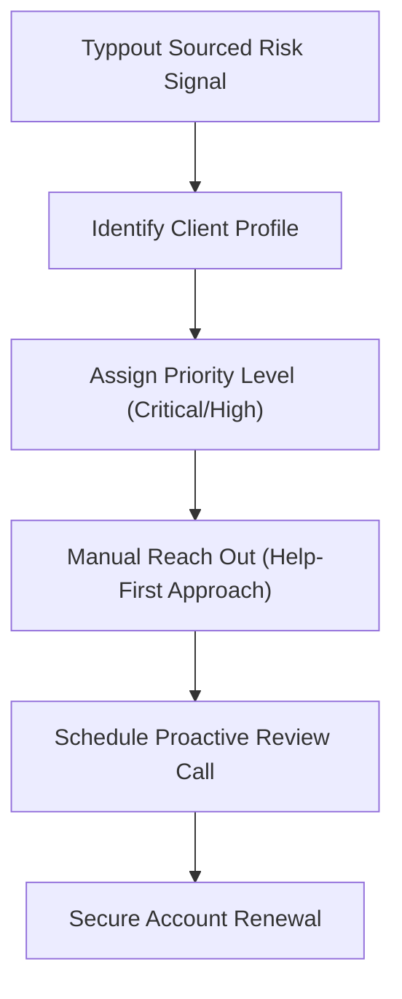

Most B2B SaaS companies treat **churn prevention** as a lagging indicator. 

They monitor customer health scores inside CS platforms (like Gainsight or ChurnZero) based on software usage data:
* Has the client logged in over the last 14 days?
* Have they completed their onboarding checklist?
* How many support tickets have they submitted?

While usage metrics are valuable, they miss a critical churn indicator: **social behavior**.

By the time a client stops logging into your platform, the decision to churn has already been made. They have already checked out, researched alternatives, and are preparing to cancel their subscription.

In 2026, forward-thinking Customer Success (CS) and account management teams are preventing churn by monitoring **real-time social signals** to spot dissatisfied accounts and intercept cancellation risks early.

Here is how to set up social listening for churn prevention. For the foundational techniques, read our comprehensive [social listening for sales](/blog/social-listening-for-sales) guide.

---

## 3 Churn Triggers Customer Success Must Monitor

To protect your recurring revenue, configure your social listener to watch your active accounts for three critical risk triggers:

### Trigger 1: Public Troubleshooting Inquiries
When a client experiences a recurring bug or is struggling to configure a feature, they often ask their peer network on LinkedIn or X for help, rather than submitting a formal support ticket.
* **The Signal**: *"Anyone else having trouble with [Your Tool's] HubSpot integration? It keeps dropping sync..."*
* **Why it's a risk**: It shows they are frustrated enough to seek external solutions publicly. They are experiencing friction that your support team is unaware of.

### Trigger 2: Seeking Niche Recommendations
When a client asks their network to suggest alternatives in your product category.
* **The Signal**: *"Looking for a simpler alternative to [Your Tool] for small teams. Must have clean reporting."*
* **Why it's a risk**: Red alert. They are actively in-market to switch vendors. Your renewal is in immediate danger.

### Trigger 3: Executive & Champion Departures
When your primary user, GTM champion, or executive sponsor changes their job status on LinkedIn.
* **The Signal**: *"Excited to announce I'm starting a new position as Head of Sales at [Different Company]!"*
* **Why it's a risk**: Churn typically occurs when your product champion leaves the company. The new replacement leader will almost always bring in their own favorite stack of tools, displacing your software.

---

## The Proactive Intercept Playbook

When your social listener detects a churn trigger from an active account, your CS team must execute a coordinated intercept:

### 1. The Immediate "Help-First" DM
Do not mention that your social listener flagged their post. Reach out directly inside their inbox offering immediate assistance with the specific feature they mentioned.
* **Script**: *"Hi [Name], saw you're expanding your HubSpot GTM operations this month! I wanted to check in to make sure our CRM sync is running perfectly for your new workflows. We recently rolled out a clean update that handles lead matching in 60 seconds. Happy to schedule a quick 5-minute call to walk your team through the setup?"*

### 2. The Executive Welcome (For Champion Departures)
When a new leader takes over, reach out to introduce yourself and present a summary of the value your platform has delivered to their company over the past 12 months.
* **Script**: *"Hi [Name], congratulations on the new role at [Company]! We've loved partnering with your team over the last year, helping them source [X] qualified social leads and save 15 hours a week in prospecting.*
* *I'd love to set up a brief 10-minute introduction to run through our roadmap and ensure we're fully aligned with your GTM goals for next quarter?"*

---

## Implementing Social Health Metrics

To integrate social health into your GTM operations:

* **Map Accounts in Your Listener**: Upload a CSV of your active paying customer domains into your social listener.
* **Sync Alerts to CS Slack Channels**: Route risk notifications directly to the Slack channel monitored by your Customer Success Managers (CSMs).
* **Speed to Intercept**: Set an SLA of **2 hours** for CSMs to reach out once a public customer frustration signal is detected.

For more on building competitive intelligence processes that also protect existing accounts, see our [competitor monitoring for social selling](/blog/competitor-monitoring-social-selling) playbook. By listening to your customers’ public thoughts and helping them proactively, you protect your net revenue retention (NRR) and build lasting client relationships.

Want to see how Typpout keeps your CS team alerted to active client risks and opportunities? [Book a 15-minute demo with our team today](https://calendly.com/arjitsinghrajput24/15min).
