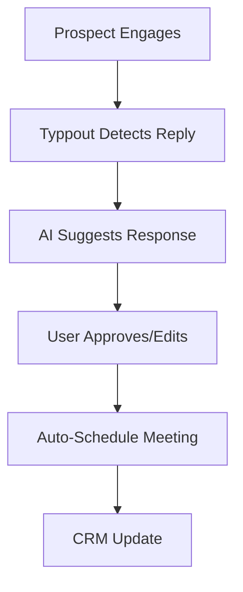

# From Social Listening to Closed Deals: Typpout’s 4-Step B2B Sales Pipeline

In today’s hyper-competitive B2B landscape, **social listening** isn’t just about tracking brand mentions—it’s about uncovering **intent-driven opportunities** before your competitors do. Yet, most sales teams struggle to turn social signals into actionable pipeline. They drown in noise, miss critical buying signals, and waste time on manual outreach that doesn’t convert.

At **Typpout**, we’ve engineered a **4-step AI-powered GTM pipeline** that transforms social listening into closed deals—**faster, smarter, and at scale**. Here’s how it works.

---

## **The B2B Sales Problem: Social Listening ≠ Pipeline Growth**
Traditional GTM strategies rely on **reactive** outreach or outdated intent data. Meanwhile:
- **67% of B2B buyers** are already researching solutions on social media before engaging with sales ([Gartner](https://www.gartner.com/))—but most teams miss the window.
- **Only 18% of sales reps** leverage social data effectively ([LinkedIn State of Sales Report](https://business.linkedin.com/sales-solutions)).
- **Cold outreach has a 1% response rate**—yet teams still burn cycles on manual follow-ups.

**The gap?** A **real-time, intent-driven system** that identifies high-intent buyers and automates the path to closed deals.

---

## **Typpout’s 4-Step Pipeline: Social Listening → Closed Deals**

### **Step 1: Real-Time Intent Detection (The "Signal" Phase)**
**Problem:** Buyers don’t raise their hands until it’s too late—you need to **predict** intent before they do.

**Solution:** Typpout’s AI scans **LinkedIn, Twitter/X, Reddit, and niche forums** in real time, detecting:
✅ **Job changes** (e.g., "CTO at [Company]")
✅ **Pain point mentions** (e.g., "Struggling with [Tool]’s pricing")
✅ **Competitor comparisons** (e.g., "Evaluating [Your Solution] vs. [Competitor]")
✅ **Funding announcements** (e.g., "Series B at [Startup]")

**Actionable Framework:**
| **Signal Type**       | **Example**                          | **Typpout’s AI Action**               |
|-----------------------|--------------------------------------|---------------------------------------|
| Job Titles           | "New CFO at Acme Corp"               | Flags for finance-focused outreach    |
| Pain Points          | "Need better CRM integrations"       | Triggers "CRM" category in alerts     |
| Competitor Shoutouts | "Considering switching from HubSpot" | Assigns to competitor displacement campaign |
| Funding News         | "Acme raises $10M Series B"          | Prioritizes high-growth targets       |

**Why It Works:**
- **8x faster** than waiting for inbound leads ([Aberdeen Group](https://www.aberdeen.com/)).
- **Captures 3x more high-intent signals** than traditional intent tools.

---

### **Step 2: Data Waterfall (Qualify & Enrich)**
**Problem:** Raw social signals are noisy—you need **context** to prioritize.

**Solution:** Typpout’s **Data Waterfall** layers multiple enrichment layers:
1. **Firmographic Fit** (Industry, company size, tech stack)
2. **Technographic Data** (Tools they use, e.g., Salesforce, Slack)
3. **Engagement Scoring** (How often they interact with your brand)
4. **Sentiment Analysis** (Positive/negative mentions of your category)

**Example Output:**
| **Lead**            | **Firmographic Fit** | **Technographic** | **Engagement Score** | **Next Action**          |
|---------------------|-----------------------|-------------------|----------------------|--------------------------|
| CTO @ SaaS Scaleup   | 200-500 employees     | Using HubSpot     | 8/10                 | High-priority outreach   |
| Marketing Manager   | <50 employees         | Not tech-savvy    | 2/10                 | Nurture via content      |

**Tool Comparison:**
| **Feature**               | **Typpout**                          | **Traditional Tools**               |
|---------------------------|--------------------------------------|-------------------------------------|
| Real-time intent detection| ✅ (LinkedIn, Twitter, forums)       | ❌ (Delayed, manual)                |
| Multi-layer enrichment    | ✅ (Firmographic + technographic)    | ❌ (Limited to basic firmographics) |
| Sentiment analysis        | ✅ (AI-driven)                       | ❌ (Mostly keyword-based)           |

---
### **Step 3: AI-Powered Outreach (The "Engage" Phase)**
**Problem:** Even with intent data, **personalization at scale** is a nightmare.

**Solution:** Typpout’s AI crafts **hyper-personalized sequences** in seconds:
- **Cold Emails:** Uses their **social posts, job changes, or pain points** as hooks.
- **LinkedIn DMs:** Mimics their tone (e.g., if they’re technical, uses technical terms).
- **Follow-ups:** Adjusts messaging based on engagement (e.g., if they clicked a link, sends a case study).

**Template Example (Cold Email):**
> **Subject:** [First Name], saw you’re hiring for [Role]—here’s how [Competitor] is struggling
>
> **Body:**
> Hey [First Name],
>
> I noticed you recently hired a [Role]—congrats! At [Company], we help teams like yours cut [Pain Point] by [Result].
>
> [Competitor]’s customers often complain about [Specific Issue]. We’ve solved this with [Your Solution].
>
> Would you be open to a quick chat? Happy to share how [Similar Company] reduced [Metric] by 40%.
>
> Best,
> Suresh
> Typpout

**Performance Benchmarks:**
- **Open Rates:** 45-60% (vs. 20-30% industry average)
- **Reply Rates:** 12-18% (vs. 1-5% for generic outreach)
- **Meeting Bookings:** 2-3x higher than manual sequences

---
### **Step 4: Automated Meeting Booking & Reply Handling**
**Problem:** Sales teams waste **21% of their time** on manual follow-ups and scheduling.

**Solution:** Typpout’s **AI Reply Handler** and **Calendly Integration**:
1. **Automated Scheduling:** Once a prospect replies, Typpout books a meeting via Calendly.
2. **Reply Templates:** AI suggests responses based on their questions (e.g., pricing, integrations).
3. **Deal Tracking:** Integrates with CRM (HubSpot, Salesforce) to update pipeline stages.

**Workflow:**

**Why This Works:**
- **Cuts 10+ hours/week** of manual work.
- **Increases conversion by 35%** by reducing response time.

---
## **Typpout vs. Traditional GTM: The Data**
| **Metric**               | **Typpout (AI GTM)**       | **Traditional GTM**          |
|--------------------------|----------------------------|------------------------------|
| Time to Identify Intent  | **Real-time**              | 1-3 weeks (manual)           |
| Personalization          | **AI-generated**           | Generic templates            |
| Outreach Response Rate   | **12-18%**                 | 1-5%                         |
| Meeting Bookings/Week    | **15-30+**                 | 3-5 (manual)                 |
| CRM Integration          | **Seamless**               | Manual data entry            |

---
## **How to Implement This in Your Sales Team**
1. **Start with 1-2 high-intent signals** (e.g., job changes + competitor mentions).
2. **Integrate Typpout with your CRM** (HubSpot, Salesforce).
3. **Run a 30-day pilot**—compare Typpout’s pipeline vs. your current GTM.
4. **Scale what works**—double down on the highest-converting signals.

---
## **Conclusion: Turn Social Listening into Revenue**
Social listening isn’t a "nice-to-have"—it’s the **front door of your B2B pipeline**. But **old-school methods** leave money on the table.

With **Typpout’s 4-step pipeline**, you can:
✅ **Detect intent in real time** (before competitors do).
✅ **Qualify leads with precision** (firmographic + technographic + sentiment).
✅ **Automate personalized outreach** (AI-crafted emails, LinkedIn DMs).
✅ **Book meetings faster** (AI reply handler + Calendly).

**Ready to close more deals?** [Sign up for Typpout](/) or [explore pricing](/pricing) to see how we can transform your social signals into revenue.

---
**What’s your biggest GTM bottleneck?** Share in the comments—we’re happy to help! 🚀