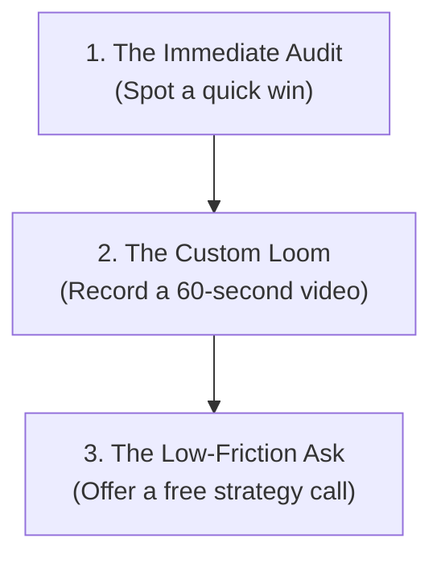

For B2B service agencies (marketing, web design, software development, or recruiting), lead generation is a constant roller coaster. You are either fully booked with client work or desperately searching for your next project.

To break this feast-or-famine cycle, most agencies rely on expensive methods:
* Paying $200+ per lead on review directories (like Clutch or G2).
* Running highly competitive Google or LinkedIn Ads that eat into margins.
* Blasting cold email databases that yield low reply rates.

In 2026, high-growth agencies are winning high-value **retainer clients** using a faster, organic channel: **Social Listening**.

By monitoring public discussions from startup founders, CMOs, and heads of product on LinkedIn and X, agencies can identify companies experiencing immediate pain points and offer help exactly when they need it.

Here is the step-by-step agency lead generation playbook. For a broader overview of social selling in the agency context, read our [social selling for agencies](/blog/social-selling-for-agencies) guide.

---

## 3 Intent Signals That Mean a Retainer Opportunity

To win high-value retainer contracts, configure your social listener to monitor three primary agency triggers:

### 1. The "Outsourced Partner" Request
When a founder or leader decides to hire an agency rather than building an expensive in-house team.
* **Trigger Phrases**: *"Recommend a web design agency"*, *"Looking for a dev shop"*, or *"Need B2B marketing help"*
* **Example**: *"Looking for a growth marketing agency that specializes in seed-stage B2B SaaS. Must have proven experience with LinkedIn Ads. Please drop recommendations."*

### 2. The "Agency Dissatisfaction" Complaint
When a client is frustrated with their current agency partner due to slow communication, poor results, or lack of strategic direction.
* **Trigger Phrases**: *"Frustrated with our marketing agency"*, *"Web agency issues"*, or *"agency underperforming"*
* **Example**: *"Our current web dev agency has missed three consecutive milestones. Genuinely frustrating when simple updates take weeks. Anyone have a reliable team they recommend?"*

### 3. The "In-house Bottleneck" Hiring Cry
When a company starts posting multiple high-level job openings, indicating they have immediate budget but are struggling to find and recruit human talent.
* **Trigger Phrases**: *"hiring senior designer"*, *"struggling to find a dev"*, or *"recruiting bottleneck"*
* **Example**: *"We've been searching for a senior React engineer for two months and keep hitting a wall. If you know anyone, send them our way!"* (An agency can pitch an immediate fractional resource to bridge the gap).

---

## The Value-First Agency Pitch

When responding to an agency trigger, **never send a generic brochure or pricing sheet**. Your outreach must demonstrate immediate technical competence. Use this step-by-step formula:

### Step 1: The Immediate Audit
Go to the prospect’s website or digital assets. Identify one concrete, high-impact area of improvement. 
* If you are a design agency, spot a mobile responsiveness issue.
* If you are an SEO agency, spot a broken meta tag or schema error.
* If you are a development shop, spot a page latency bug.

### Step 2: The Custom Loom
Record a quick, 60-second video showing their site, explaining the bug, and showing how you would resolve it. 
* *Script*: *"Hey [Name], saw your post looking for web developers. I took a quick look at your landing page and noticed that your mobile form load times have a 3-second latency issue, which is likely costing you 20% in conversion. Here is exactly how we'd fix it using clean hydration..."*

### Step 3: The Low-Friction Ask
Offer a brief, value-first strategy session to map out their solution.
* *Script*: *"We built a clean, 2-page checklist on how to optimize React load times. Happy to drop it here, or run a quick technical audit of your other pages on a brief chat?"*

---

## Automating Agency Prospecting

Manually searching socials for agency triggers while managing client projects is impossible. You need automated listening infrastructure to maintain a consistent pipeline.

Deploy [Typpout](/) as your autonomous agency SDR. 

Our social listening engine scans LinkedIn, X, and Instagram 24/7 for founders and marketing leaders looking for help. It resolves their professional emails, enriches their stack details, and alerts your team instantly, allowing you to drop a custom Loom into their inbox before any competitor agency even spots the post.

For the underlying technology and strategy, see our comprehensive guide on [social listening for sales](/blog/social-listening-for-sales). Break the feast-or-famine cycle. Automate your agency pipeline today.

Ready to win high-value retainer clients on autopilot? [Schedule a 15-minute demo with Typpout](https://calendly.com/arjitsinghrajput24/15min) today.
