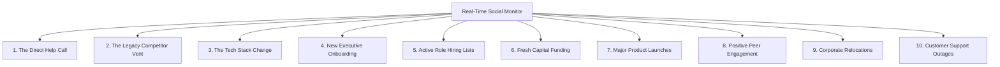

The difference between a closed-won deal and a deleted email is **timing**.

If you reach out to a target company when their budget is locked, their priorities are set, and their current software is running smoothly, your reply rate will be 0%. 

If you reach out to that exact same company when their current stack breaks, their executive sponsor departs, or they secure a fresh round of funding, you enter a highly receptive buying window.

These moments of transition are called **Social Trigger Events**. 

In 2026, high-performing B2B sales teams don't wait for prospects to find them. They deploy automated social listeners to detect trigger events in real-time, allowing them to swoop in and initiate conversations at the moment of peak intent.

Here are the top 10 social trigger events you must monitor. For a deeper dive into event-driven selling workflows, read our [event-triggered social selling](/blog/event-triggered-social-selling) guide.

---

## The 10 High-Intent Sales Triggers

### 1. The Direct "Help Call" (Recommendation Request)
The holy grail of sales triggers. A decision-maker posts a direct inquiry asking their network to recommend a vendor or solution in your category.
* **The Signal**: *"What is the best AI SDR platform for startups in 2026?"*

### 2. The Legacy Competitor Vent
When a customer complains publicly about a competitor’s recent software updates, pricing increases, or contract terms.
* **The Signal**: *"Frustrated with [Competitor's] renewal rates. Time to find a lighter alternative."*

### 3. The Technographic Stack Change
When an account installs a key piece of technology or removes a legacy competitor. This signals a willingness to invest and indicates a change in operational priorities.
* **The Signal**: Target company integrates HubSpot CRM to their site stack.

### 4. The New Executive Onboarding
When a new VP of Sales, CMO, or CTO announces their new position. New leaders almost always evaluate their inherited stack and bring in their own favorite tools during their first 90 days.
* **The Signal**: *"Excited to announce I'm starting as Head of GTM at [Company]!"*

### 5. Active Role Hiring Listings
When a target account starts posting job listings for roles that use or manage your category of software (e.g., hiring 3 new "SDRs" is a massive trigger for an outreach platform).
* **The Signal**: Company posts a job opening for a *"Sales Development Manager."*

### 6. Fresh Capital Funding Rounds
When a company secures a pre-seed, seed, or Series A funding round. They have fresh capital, ambitious growth targets, and must immediately invest in GTM infrastructure to scale.
* **The Signal**: *"Excited to share we've raised $5M in seed funding to expand our engineering team!"*

### 7. Major Product or Feature Launches
When a target account launches a new product line or expands into a new geography, indicating they need to generate pipeline fast.
* **The Signal**: *"We are officially launching our new enterprise API today!"*

### 8. Positive Peer Engagement (Influencer Comments)
When a prospect comments on a high-authority influencer's post discussing the exact problem you solve, agreeing with the frustration.
* **The Signal**: Commenting *"Struggling with this all quarter"* on an outreach deliverability thread.

### 9. Corporate Relocations & M&A Activity
When a target account undergoes a merger, acquisition, or moves their primary headquarters, indicating operational reorganization.
* **The Signal**: News alert about a corporate merger in your sector.

### 10. Competitor Customer Support Outages
When a competitor experiences technical downtime and their customers flood social media asking for updates.
* **The Signal**: Thread on X complaining about *"API downtime on [Competitor]."*

---

## Automating the Trigger-Response Loop

Manually scanning the social web for these 10 trigger events across hundreds of accounts is an impossible challenge. You need automated listening infrastructure to capture the timing advantage.

Deploy [Typpout](/) as your autonomous trigger listener.

Our real-time engine scans LinkedIn, X, and Instagram for all 10 events 24/7. When a trigger is detected, Typpout enriches the contact’s corporate identity, evaluates their ICP fit, and queues up a contextual outreach draft, allowing you to engage at the moment of peak intent, before any competitor spots the window.

For a complementary keyword-level approach, see our guide on [buyer intent keywords by industry](/blog/buyer-intent-keywords-by-industry). Timing is your unfair advantage. Automate your listening today.

Ready to capture real-time trigger events and book more meetings? [Book a 15-minute demo with Typpout today](https://calendly.com/arjitsinghrajput24/15min).
