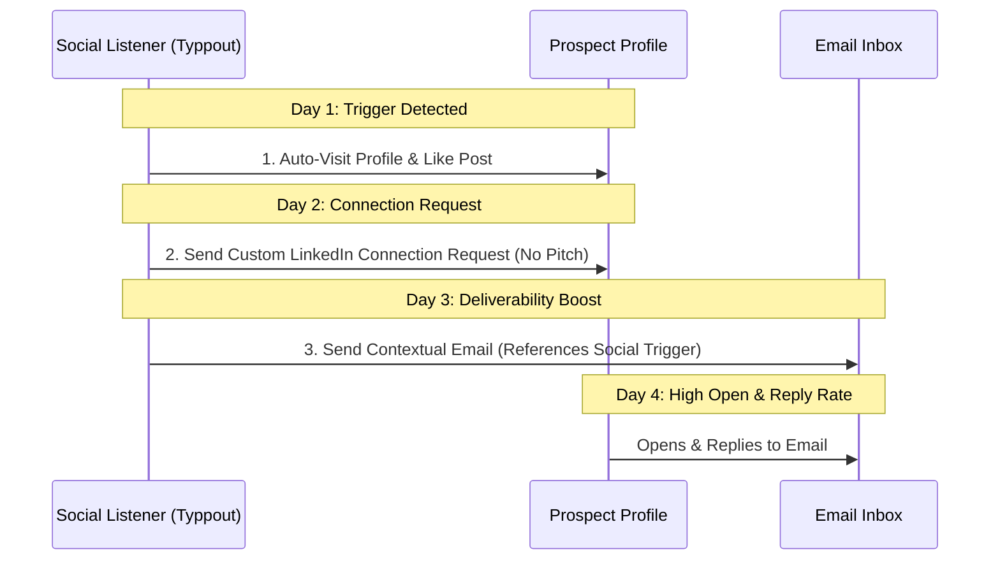

In 2026, cold email deliverability is a minefield. Google and Yahoo’s aggressive inbox filters, combined with strict domain-level spam thresholds (such as keeping spam complaints below 0.3%), have made list-blasting obsolete.

If you buy a contact list, upload it to a sequencer, and send 200 cold emails a day from a fresh domain, your emails will land directly in the spam folder within two weeks.

To achieve consistent **95%+ inbox placement**, you must prove to the spam filters that your emails are expected, relevant, and engage recipients. 

The secret weapon to bypass modern spam filters is **Social Warm-up**. By executing micro-touchpoints on social media before your email ever hits the prospect's inbox, you drastically increase open and reply rates, sending strong positive engagement signals to the email algorithms.

Here is the exact playbook to use socials to maintain pristine email deliverability.

---

## Why Spam Filters Care About Social Engagement

Email algorithms (like Gmail's Spam Filter and Microsoft Outlook's Defender) evaluate **recipient engagement** to determine your sender reputation. 

If you send 100 emails and:
* **Scenario A (Cold Blast)**: 15 people open, 0 reply, and 2 mark as spam. Your domain reputation takes a massive hit.
* **Scenario B (Social Warm-up)**: 65 people open, 12 reply, and 0 mark as spam. Your domain reputation climbs, guaranteeing future placement in the primary inbox.

By engaging with a prospect on LinkedIn or X first, you familiarize them with your name and brand. When they see your email in their inbox a day later, they don't flag it as spam; they open it and read it.

---

## The 4-Day Multichannel Warm-Up Cadence

To implement this model, coordinate your social actions and email sequences using this automated flow:

### Day 1: The Social Footprint
* **Action**: Automatically visit the prospect's LinkedIn profile and leave a like on their latest post or comment.
* **Why it works**: The prospect receives a notification showing your name and face, planting the first seed of brand familiarity.

### Day 2: The Soft Connection
* **Action**: Send a connection request. Do *not* include a sales pitch. Just say: *"Hey [Name], saw your post about [topic]. Loved your perspective on it. Wanted to connect."*
* **Why it works**: Over 45% of prospects accept warm connection requests, creating a direct communication channel.

### Day 3: The Contextual Email
* **Action**: Send your first email. The subject line and opening hook should reference the social trigger from Day 1.
* **Subject Line**: *Quick question about your LinkedIn post on [Topic]*
* **Opening Hook**: *"Hi [Name], saw your post yesterday about your GTM bottlenecks. Loved the point you made about list scrubbing..."*
* **Why it works**: The recipient recognizes your name from their LinkedIn notifications. The email feels like a natural continuation of a public discussion rather than a cold sales intrusion.

---

## Setting Up Your Multichannel Workflow

Executing this sequence manually for dozens of accounts takes hours of tracking. Instead, use a GTM automation platform like [Typpout](/):

1. **Configure Your Signals**: Set up Typpout to detect intent triggers across socials.
2. **Auto-Trigger the Touchpoints**: When a signal is detected, Typpout automatically visits the profile, triggers a connection request, and enriches their email.
3. **Pipe to Your Sequencer**: Sync the enriched contact and their custom trigger data directly to your email tool (HubSpot, Instantly, or Lemlist) to start the contextual sequence immediately.

By ensuring that every cold email is preceded by a warm social touchpoint, you protect your email domains, beat the spam filters, and book significantly more meetings.

Want to see how to coordinate social triggers and email sequences for maximum deliverability? [Book a 15-minute demo with Typpout today](https://calendly.com/arjitsinghrajput24/15min).
